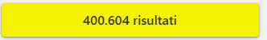

# AutoScout24 scraping &nbsp;

This repository contains a notebook to extract offers from the website [AutoScout24](https://www.autoscout24.it/?cq_src=google_ads&cq_cmp=20946303485&cq_term=autoscout&cq_plac=&cq_net=g&cq_plt=gp&utm_source=google&utm_campaign=IT_AS24_ugom_web_lead_%5Bs%5D_%28B%29_Strict&utm_medium=cpc&utm_content=%28B%29_Strict&utm_term=autoscout&gad_source=1&gclid=CjwKCAiAw5W-BhAhEiwApv4goOjr1NBozkmG-yDcR6nITwfYg_lzW61123RzOwdR1y8FcBZzQeaICBoCGPAQAvD_BwE).

## Steps

### 1) Advanced search

 

Search a car setting own custom criteria here [Criteria](https://www.autoscout24.it/ricerca-avanzata?sort=standard&desc=0&ustate=N%2CU&atype=C&cy=I&source=homepage_search-mask&_gl=1*k6ctgz*_up*MQ..*_gs*MQ..&gclid=CjwKCAiAw5W-BhAhEiwApv4goOjr1NBozkmG-yDcR6nITwfYg_lzW61123RzOwdR1y8FcBZzQeaICBoCGPAQAvD_BwE)

Click on the yellow button at the end of the page



### 2) Get the base URL of the results

Click on the URL bar, copy the link and paste it in the notebook in the following cell:

```python
base_url = <your_url>
```

### 3) Run the notebook and get results

Run all cells of the notebook and two different files will be generated:
- **used_cars.xlsx**: excel containing the results
- **used_cars_sorted.xlsx**: excel containing the results sorted by mileage, year, month and price
